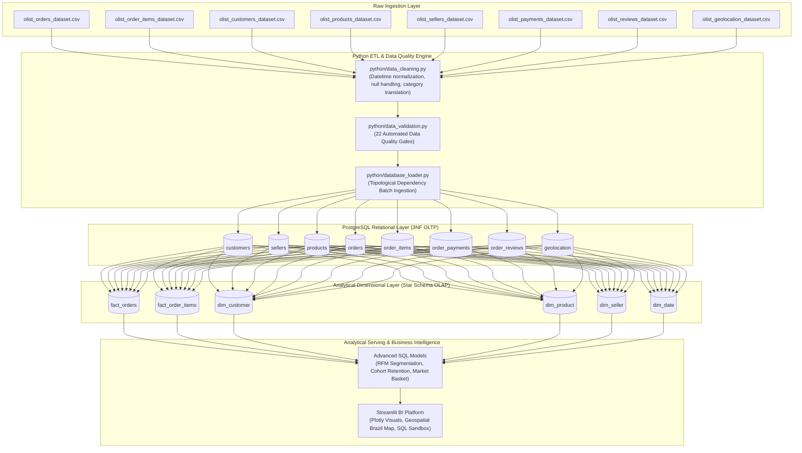
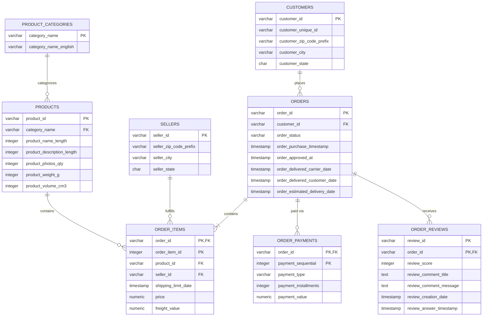
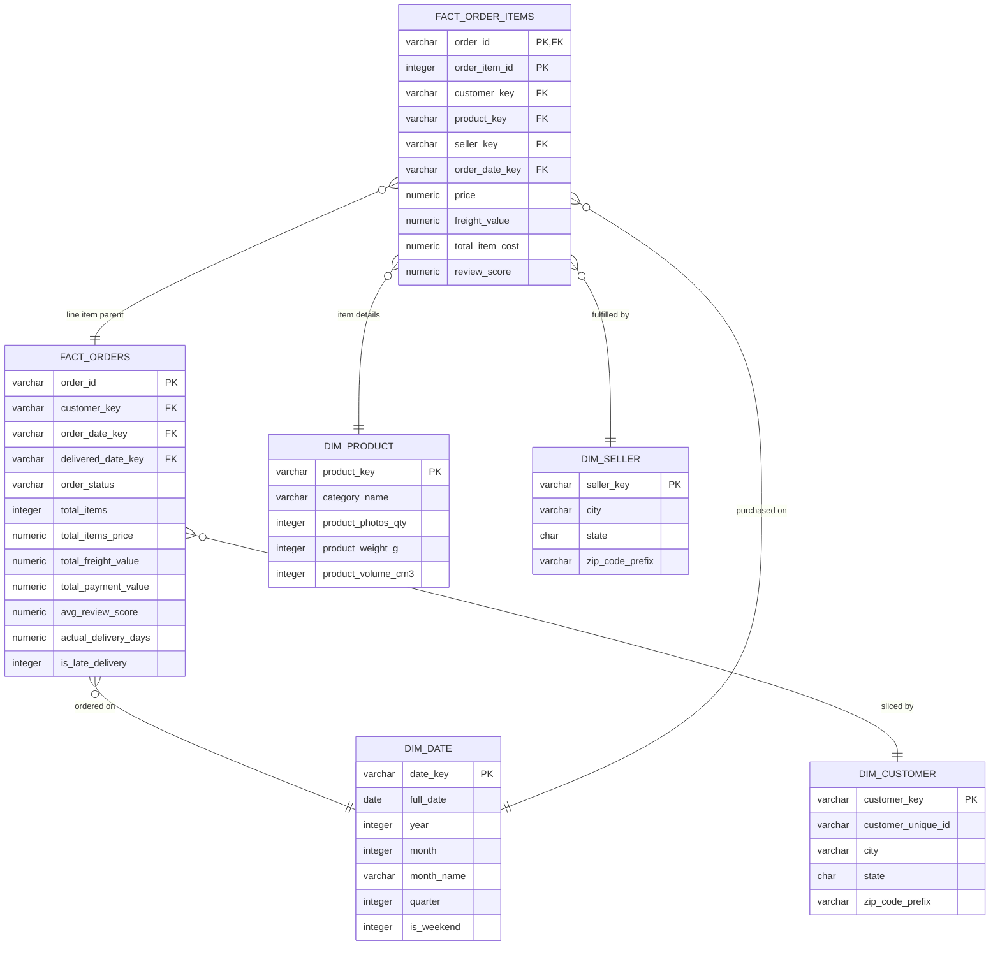

# CommerceIQ: Architectural Blueprints & Data Lineage

This document outlines the conceptual, logical, and physical architectures of the **CommerceIQ Platform**, contrasting the **Normalized 3NF Transactional Layer (OLTP)** with the **Kimball Star Schema Analytical Mart (OLAP)**.

---

## 1. End-to-End System Lineage Diagram

---

## 2. Relational OLTP Entity-Relationship Diagram (3NF)

---

## 3. Kimball Star Schema Dimensional Model (OLAP)

